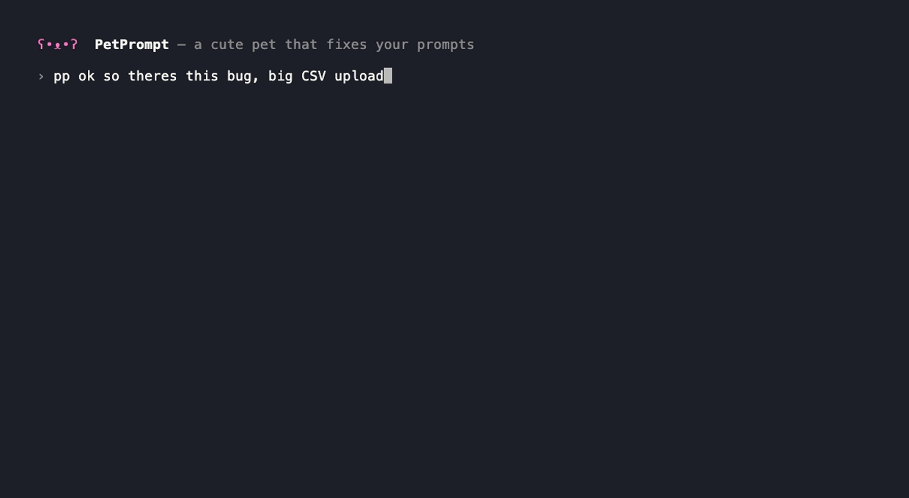

<div align="center">

# ʕ•ᴥ•ʔ Prompet

[English](README.md) · **简体中文** · [日本語](README.ja.md)

**一只住在终端里的可爱桌宠，在你发送前悄悄把粗糙的 prompt 打磨成好 prompt —— 用你当前 Claude Code 会话的上下文、记忆和模型。**

无需 API key，无需另开对话，无需来回复制粘贴。

<!-- TODO: 替换为真实的演示 GIF -->
<!--  -->

</div>

---

## 痛点

你正沉浸在 Claude Code 里，随手敲下一句粗糙的 prompt：

> 把登录页做一下

但你心里清楚，要是写成下面这样，结果会好得多：

> 修改 `src/pages/Login.tsx`：加上邮箱 + 密码校验和行内错误提示、一个"记住我"
> 复选框，以及匹配我们 Tailwind 主题的响应式布局。

于是你停下来，另开一个对话，粘贴 prompt，问一句"帮我优化下"，等结果，再复制回来，
最后才运行。**每一次都这样。**

Prompet 把这一整段绕路全省了。它就住在你的会话里，在你回车的那一刻替你打磨好 prompt。

## 工作原理

Prompet 注册了一个 Claude Code 的 **`UserPromptSubmit` hook**。当你提交 prompt 时：

```
你的粗糙 prompt
        │
        ▼
  ┌───────────┐   读取：本会话的模型 · 对话记录 · CLAUDE.md 记忆
  │  Prompet  │ ──────────────────────────────────────────────────────►
  │   hook    │   调用你本地已装的 `claude -p`（同一登录、模型、额度）
  └───────────┘
        │
        ▼
  一条清晰、贴合上下文的 prompt 交给 Claude —— 桌宠鼓掌 ✨
```

- **用你的会话，而不是另起炉灶。** 优化跑在*你当前窗口正在用的同一个模型*上，走你现有的
  Claude Code 登录 —— 所以**不需要 API key**，也走**同一份额度**。（也可以单独指定一个更快的模型来优化。）
- **像 `/btw`，但不用你手动打字。** 它会读取最近的对话和你项目 + 用户级的 `CLAUDE.md` 记忆，
  于是"把登录页做一下"会变成一条真正了解你技术栈和文件的 prompt。
- **设计上很安全。** Claude 仍然能看到你的原始 prompt；优化版是作为权威性引导*追加*进去的，
  而非悄悄替换。一旦优化出错或超时，你的原始 prompt 会**原封不动**地通过 —— Prompet 永远不会卡住你。
- **状态栏里的一只桌宠。** ʕ•ᴥ•ʔ 平时发呆，优化时转圈，完成时给你一个 ✨。

## 安装

### 方式 A —— Claude Code 插件（推荐）

```text
/plugin marketplace add zjchenQAQ/prompet
/plugin install prompet
```

然后重启 Claude Code。搞定 —— hook、状态栏桌宠、`/prompet:optimize` 命令全部就绪。

### 方式 B —— npm + 一条命令

```bash
npm install -g prompet
prompet init       # 把 hook + 状态栏写入 ~/.claude/settings.json
prompet doctor     # 检查是否就绪
```

> 需要 **Node.js ≥ 18** 和在 PATH 中的 **Claude Code CLI**（`claude`）。

## 使用

装好后，照常用 Claude Code 即可。实质性的 prompt 会被自动优化；琐碎的（`yes`、`continue`、
`run it`、斜杠命令等）会被放过。

想自己掌控？用预览命令 —— 它会把优化后的 prompt 展示给你看，而不是自动套用：

```text
/prompet:optimize 加个深色模式开关
```

或在任意 shell 里：

```bash
prompet optimize "加个深色模式开关"
echo "加个深色模式开关" | prompet optimize
```

## 模式

用 `prompet mode <m>`（或 `prompet on` / `prompet off`）切换 hook 的行为：

| 模式 | 行为 |
| --- | --- |
| `auto`（默认） | 自动优化实质性 prompt；跳过琐碎的。 |
| `marker` | 仅优化以 marker（默认 `pp `）开头的 prompt。 |
| `manual` | 从不自动优化；需要时用 `/prompet:optimize`。 |
| `off` | 什么都不做。 |

## 配置

`prompet config` 打印全部配置；`prompet set <键> <值>` 修改。存储于
`~/.claude/prompet/config.json`。

| 键 | 默认值 | 含义 |
| --- | --- | --- |
| `mode` | `auto` | `auto` · `marker` · `manual` · `off` |
| `optimizeModel` | `inherit` | `inherit` = 跟随会话模型；或指定 id，如 `claude-haiku-4-5` 提速 |
| `lang` | `auto` | 界面语言：`auto` · `en` · `zh` · `ja` |
| `marker` | `pp ` | `marker` 模式下触发优化的前缀 |
| `minWords` / `minChars` | `4` / `16` | auto 模式：短于此则跳过 |
| `contextMessages` | `12` | 喂给优化器的最近消息条数 |
| `timeoutMs` | `25000` | 优化超时（控制在 30s hook 上限内）|
| `showNote` | `true` | 优化时显示一行提示 |

```bash
prompet set optimizeModel claude-haiku-4-5   # 更快更省地优化
prompet lang zh                              # 界面切到中文
prompet mode marker                          # 只优化以 "pp " 开头的 prompt
prompet off                                   # 暂停 Prompet
```

## 隐私

Prompet 完全运行在你本机，只和你自己的 `claude` CLI 通信。你的 prompt、最近对话和记忆，
**与你平时正常发 prompt 的方式完全一致**地发送给 Claude —— 不经过任何第三方服务器或 key。

## 命令

```text
prompet init | uninstall | doctor        安装与自检
prompet on | off | mode <m>              行为
prompet lang <code>                      界面语言
prompet config | set <键> <值>           配置
prompet optimize [文本]                  优化一段 prompt 并打印
prompet help | version
```

## 路线图

- [x] 界面 + README 多语言（English / 简体中文 / 日本語）
- [ ] **Codex 支持**（基于 `codex exec` 的优化）—— *下一版*
- [ ] 剪贴板 / 全局热键模式，可在编码 agent 之外使用
- [ ] before/after 对比视图
- [ ] 桌宠个性与皮肤

## 贡献

欢迎提 issue 和 PR。Prompet 刻意保持**零依赖、纯 Node**，让 hook 足够快、随处可装。

## 许可证

MIT © [zjchenQAQ](https://github.com/zjchenQAQ)
